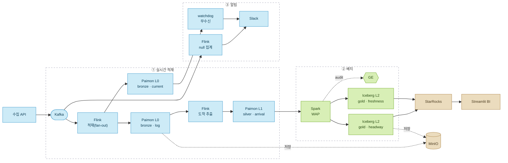

# 서울 지하철 배차 안정성(headway) 파이프라인 — 1·2·9호선

실시간 열차 위치 API를 직접 수집해, **출퇴근 시간대에 어느 노선·역·방향에서 배차 간격(headway)이
불안정해지는가**를 *전 구간 품질 검증을 통과한* 지표로 집계·서빙하는 하이브리드 데이터 파이프라인.


> **중점 질문.** "출퇴근 시간대에 어느 구간·시간대 배차가 불안정한가?"
> **이 답이 바꾸는 결정.** 어느 구간·시간대에 배차 조정/시간표 패딩이 필요한가(운영자), 또는 승객용 '대기 신뢰도'를 어떻게 표출할 것인가.

---

## 한눈에

- **수집 → BI까지 전 구간 자작·운영** — Kafka·Flink·Paimon·Iceberg·Spark·StarRocks·Airflow·GE·Streamlit.
- **멱등 보장** — log 147,698행 ≥ current 51,621행 (중복 수신·재처리에도 결과 불변).
- **1,410개 분석 그룹**(역×방향×시간대)을 품질 검증 통과 상태로 서빙.
- **다층 데이터 품질** — WAP + GE(배치) · validity/completeness 실시간 알람(스트리밍) · 멱등성.
- **핵심 발견** — *노선의 구조가 배차 안정성을 좌우한다* (순환선 2호선이 가장 안정, 분기 노선 1호선이 가장 불안정).

---

## 핵심 성격

- **운행 품질형 BI** — 승객·매출이 아니라 **열차 운행 상태 이벤트**(노선·열차번호·현재역·상태·방향·급행/막차·수신시각)를 다룬다. "공급(배차)이 규칙적인가"를 묻지, 수요(승하차)는 다루지 않는다.
- **백필 불가 → streaming의 정당성.** 실시간 위치 API는 "지금" 값만 주고 과거를 제공하지 않는다. 지금 폴링해 쌓지 않으면 분석 데이터가 0이다. 그래서 **수집은 실시간(필연), 분석은 배치**다.
- **신뢰는 끝(BI)에서 검증.** DAG 성공 ≠ 데이터 정상. 검증과 증거를 파이프라인 끝단에 둔다.

---

## 아키텍처



<details>
<summary>텍스트(ASCII) 버전</summary>

```
[실시간 위치 API]  1·2·9호선, 러시아워 윈도우 폴링(30~40s)
       │ producer
       ▼
     Kafka  (subway-events, 30일 보관)
       │ Flink (STATEMENT SET fan-out)              └─▶ ③ 실시간 알림 레인
       ▼                                                 ├ Flink 1분 null 집계  → Slack (validity)
  Paimon L0 (MinIO)                                      └ watchdog 무수신 감지 → Slack (completeness)
   ├ subway_position_log     (append · 원본 폴링 · dt 파티션)
   └ subway_position_current (upsert · event_id · 현재 상태)
       │ Flink (keyed CEP: 역 전이 → 도착 추출)
       ▼
  Paimon L1  silver.subway_arrival_events  (열차×역×도착시각)
       │ Spark WAP (write → GE audit → publish → validate)
       ▼
  Iceberg L2 (gold)
   ├ subway_headway_by_station_tod  (역×방향×시간대 · P50/P90/CV ★)
   └ subway_service_freshness        (노선×분 · 수신 heartbeat)
       │ StarRocks (Iceberg External Catalog · zero-copy)
       ▼
     Streamlit BI  (불안정 역 Top N + freshness 패널)
```

</details>

메달리온(L0 원본 → L1 정제 → L2 집계 결정 마트) 구조. 다이어그램 소스: [`docs/architecture.mermaid`](docs/architecture.mermaid).

---

## 마트 설계 (계층 · grain)

| 마트 | 계층 | grain | 내용 |
|---|---|---|---|
| `subway_position_log` | L0 | poll 스냅샷 | 원본 위치(가공 전), 모든 폴링 보존 |
| `subway_position_current` | L0 | event_id | 디덥된 현재 상태 (watchdog 시드로도 사용) |
| `subway_arrival_events` | L1 | 열차×역×도착시각 | 역 전이 감지로 추출한 도착 이벤트 |
| `subway_headway_by_station_tod` ★ | L2 | 역×방향×시간대×요일유형 | headway P50/P90/CV·초과비율 |
| `subway_service_freshness` | L2 | 노선×분 | 수신 heartbeat/끊김(파이프라인 건강) |

한 행의 의미(grain)가 **폴링(L0) → 도착(L1) → 그룹 통계(L2)** 로 단계마다 굵어진다.

---

## 핵심 지표

- **주지표** — 역·방향·시간대별 headway의 **변동계수(CV = 표준편차÷평균)**, P50/P90, 관측 중앙값 대비 1.5배 초과 비율. CV가 높을수록 배차가 들쭉날쭉(불안정).
- **보조지표** — 데이터 freshness(분당 수신 heartbeat / 윈도우 내 끊김), 구간 소요시간(로드맵).
- *headway는 지점(역)에서 측정한다.*

---

## 데이터 품질 & 운영 (DQ)

> "나쁜 데이터가 의사결정에 닿지 않게 막는다." 검증 전엔 서빙에 반영하지 않고(WAP), 못 막은 건 즉시 알린다(Alert).

**① WAP (Write–Audit–Publish)** — `scripts/ops/wap.sh`, `labs/13-spark-headway/headway_wap.py`
임시(staging)에 쓰고 → **GE로 audit** → 통과해야 gold로 **원자적 교체(publish)** → 재확인(validate). 위반 1건이라도 있으면 publish 중단 → 사용자는 항상 직전 정상본만 본다.

**② GE Expectations** — `labs/16-data-quality/`
`cv ∈ [0,3]` · `direction ∈ {상행, 하행}` · 키 컬럼 not-null · `p90 ≥ p50` · grain 유일성. 오염을 주입하면 `success=False`로 막아내는 것을 음성 통제로 검증.

**③ 실시간 알람 — 두 종류를 분리** — `labs/17-alerting/`
- **validity**(들어온 행이 틀림): Flink가 Kafka를 1분 윈도우로 보며 핵심 필드 null 감지 → Slack(CRITICAL).
- **completeness**(행 자체가 안 옴): `heartbeat_watchdog.py`가 (노선·방향)별 '마지막 수신 경과시간'을 추적 → Slack(WARN). *윈도우 집계로는 '없는 행'을 못 세기 때문에 별도 레인.*

**④ 멱등성** — `(열차번호, 역, 상태, 날짜)` dedup 키 + Paimon upsert + Iceberg 원자 교체로 중복 수신·재실행에도 표본이 부풀지 않음.

**⑤ 장애 드릴 & 복구** — `labs/18-ops-recovery/`, `scripts/ops/r5-*.sh`
*"배치 성공인데 BI 공백(R5)"* 을 일부러 재현 → DAG 성공이 데이터 정상을 보장하지 않음을 입증 → **Iceberg 스냅샷 롤백 + StarRocks refresh**로 headway 0 → 1,410 복구. 운영 점검(smoke/offset·lag/compaction 등)은 증거(스크린샷·행수·로그)로 남긴다.

---

## 주요 결과

**노선 구조가 배차 안정성을 좌우한다** — 평균 CV 기준:

| 노선 | 평균 CV | 해석 |
|---|---|---|
| **2호선** | ~0.29 (가장 안정) | 순환선 — 분기·급행 없음, 고빈도 |
| **9호선** | ~0.45 (중간) | 급행/완행 혼용 → 같은 역 불규칙 도착 |
| **1호선** | ~0.54 (가장 불안정) | 분기 노선(인천/서동탄 등) → 행선지 혼재 |

불안정 역 상위는 **9호선 급행 정차역**(가양·여의도·당산·고속터미널)과 **1호선 분기·환승역**(구로·신도림)에 집중 — 구조적 원인과 일치. `branch`(본선/지선) 분리로 드릴다운하면 2호선 밤의 변동도 **지선 상행(셔틀·연결대기·막차)** 이 끌어올린 것으로 확인된다.

---

## 디렉터리 구조

```
seoul-metro-pipeline/
├─ labs/                     # 파이프라인 단계별 코드 (번호 = 데이터 흐름 순서)
│  ├─ 03-kafka-producer/     # 실시간 위치 API → Kafka
│  ├─ 04-flink-paimon/       # Kafka → Paimon L0 (log/current) 적재
│  ├�